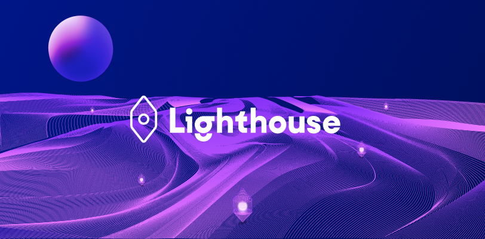

# Lighthouse's UI

  

## 🌎 What is Lighthouse?

Lighthouse is the world's leading open metaverse navigation engine. Find friends, travel, and socialize in the spatial web.

## 🧬 Features

This mono repo contains the web facing parts of Lighthouse.
- The web app that you can find at [lighthouse.world](https://lighthouse.world)
- The browser extension that we are currently migrating to Chrome manifest v3

## 🤝 Contributing

We welcome contributions to Lighthouse! Please see our [contributing guidelines](https://github.com/lighthouse-xyz/lighthouse/blob/main/CONTRIBUTING.md) for more information.

## 🚦 Quick Start

To run, Lighthouse requires a valid GCP environment and subscriptions to different third parties.
- Node 20 (e.g. via nvm)
- git clone git@github.com:lighthouse-xyz/ui.git
- Install dependencies
- Run `npm run start:prod` to start the UI on localhost:3000
